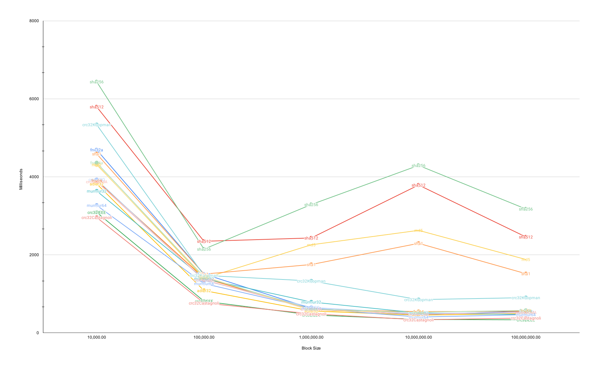

# concurrent hash
[](https://github.com/kmulvey/concurrenthash/actions/workflows/build.yml) [](https://github.com/kmulvey/concurrenthash/actions/workflows/release.yml) [](https://codecov.io/gh/kmulvey/concurrenthash) [](https://goreportcard.com/report/github.com/kmulvey/concurrenthash) [](https://pkg.go.dev/github.com/kmulvey/concurrenthash)

A simple two level [Merkle tree](https://en.wikipedia.org/wiki/Merkle_tree) for hashing large files to ensure integrity. [Fast hashing algorithms exist](https://github.com/kalafut/imohash) for the case of large files but they dont consider the entire file and thus cannot guarantee integrity. Concurrently hashing blocks of the file and then hashing the hashes is not a new idea, both zfs and btrfs hash inodes all the way up the directory tree to ensure the filesystem is not corrupted.

## Usage
#### Library
```
var ch = concurrenthash.NewConcurrentHash(context.Background(), 2, 2, sha512.New)
var hash, err = ch.HashFile(file)
fmt.Println(hash)
```

Some hash algorithms do not have constructors that return `hash.Hash` so there are [convenience wrappers](https://github.com/kmulvey/concurrenthash/blob/main/wrappers.go) you can use.

#### Cli
`./concurrenthash -file /path/to/large/file -threads 4 -block-size 1`
```
Options:
 -algos                 print available hash algos
 -file                  input file
 -hash-func             hash algo to use, default: sha256
 -threads               amount of concurrency, default: 1
 -block-size            size of the leaf nodes to be hashed, default: 1MB

```


## Benchmarks
Time to hash a 10GB file of /dev/urandom data
| algo              | time (s) |
|-------------------|----------
| adler32           | 8.02  
| crc32Castagnoli   | 6.60
| crc32IEEE         | 4.99
| crc32Koopman      | 6.18
| crc64ECMA         | 5.54
| crc64ISO          | 4.20
| fnv32             | 4.15
| fnv32a            | 4.14
| fnv64             | 4.58
| fnv64a            | 4.33
| md5               | 19.01
| murmur32          | 5.05
| murmur64          | 5.36
| sha1              | 13.07
| sha256            | 18.14
| sha512            | 18.10

## Block size benchmarks
[Raw data](./benchmarks.csv)

